# NBA Fantasy Draft Helper — full methodology & results report

*Generated 2026-10-08 by `scripts/make_report.py` from the project's data and models. League: ESPN · 10 teams · snake · 9-category head-to-head (weekly matchup W/L) ·
daily lineups · PG SG G SF PF F C 3×UTIL · 3 bench · 1 IR · max 3 centers · 18 + 3 weeks (two-week matchups: week 7 = Nov 30–Dec 13, week 17 = Feb 15–28).*

**Contents** 1 Summary · 2 Data · 3 Features & shrinkage · 4 Model evaluation (incl. residual diagnostics) · 5 Rookies · 6 2026-27 projections · 7 Risers & fallers · 8 Simulation · 9 Draft engine · 10 Validation · 11 How to run · 12 Limits & open questions

## 1. Executive summary

**The question.** In a 10-team ESPN snake draft with nine categories, head-to-head weekly matchups decided win/loss, daily lineups, PG/SG/G/SF/PF/F/C/3×UTIL slots and a
3-center cap: *who should I take with my next pick, given everything already drafted?*

**The approach, in one paragraph.** (1) Project each player's next-season per-game stats from his last three seasons plus age and role, choosing the best model per stat by
a rolling backtest. (2) Turn each average into thousands of realistic simulated weeks — real schedule, injuries, streakiness, correlated stats, and uncertainty about the projection itself.
(3) For every candidate pick, play out the rest of the draft and the season's weeks with daily lineups, and recommend the player who maximises the probability of winning a weekly matchup.

**What we found.**

* **Projections** beat "same as last year" on every one of the nine categories out of sample (average rank correlation with true fantasy value
  **0.670** vs **0.618**; identified **62%** of the season's top-50 players in advance vs
  **55%**). The largest gains come from minutes and availability; shot-efficiency stats are mostly luck and are shrunk heavily.
* **2026-27 top five by projected value:** Shai Gilgeous-Alexander, Nikola Jokić, Victor Wembanyama, Tyrese Maxey, Scottie Barnes.
* **Simulation** reproduces the real spread of weeks on a season it never saw: in a 2025-26 test with everything built from pre-2025 data, actual player-weeks fell in the lowest/highest 10% of the
  simulated range 10.8% / 12.8% of the time (nominal 10%) — close to calibrated, a little over-confident in the upper tail. An earlier version was
  clearly over-confident because of an availability-estimation bug that this very check exposed and that is now fixed (section 8.4).
* **Validation (the honest part).** In 96 paired mock drafts scored on real 2022-2025 seasons (actual day-by-day box scores), the engine's team scored **-0.8 ± 1.7** points of weekly matchup win probability relative to a 'take the best player left' team — within noise — no demonstrable edge (section 10). The projections and value board are doing nearly all the work; the engine is a well-explained second opinion (category balance, positions, center cap), not a proven upgrade.
* **Data used:** 281,164 player-games from 13,209 games (2015-16 → 2025-26), the published 2026-27 schedule, nba_api bios; 99% of team-games pass the 240-minute integrity check.

**What is not done / needs your input** is in section 12.

## 2. The data

### 2.1 Where the data comes from

| Source | What we take | Why |
|---|---|---|
| `nba_api` · `LeagueGameLog` | every player's box score in every regular-season game, 2015-16 → 2025-26 | the raw facts everything is built from |
| `nba_api` · `PlayerIndex` | position label, draft slot, rookie year, current team — **including the incoming rookie class** | rookies have no box scores; draft slot is our only prior for them |
| `nba_api` · `LeagueDashPlayerBioStats` | age by season | aging is a core driver of projections |
| `nba_api` · `ScheduleLeagueV2` | the published 2026-27 schedule (1200 games, 2026-10-20 → 2027-04-11) | the simulation plays every player on the real days his team plays |
| ESPN fantasy API *(you run once)* | exact position eligibility + average draft position | position slots and opponent behaviour |

Only **regular-season** games count (game ids starting `002`). The NBA Cup *final* has a different id family (`006…`) and is
not part of your fantasy season, so it never enters; the Cup quarter- and semifinals *are* regular-season games and do.

### 2.2 What is in the database

| season | games | player_games | players | team-games with correct minutes (%) |
|---|---|---|---|---|
| 2015-16 | 1230 | 26078 | 476 | 99.6 |
| 2016-17 | 1230 | 26139 | 486 | 99.8 |
| 2017-18 | 1230 | 26107 | 540 | 99.4 |
| 2018-19 | 1230 | 26101 | 530 | 99.6 |
| 2019-20 | 1059 | 22393 | 529 | 99.6 |
| 2020-21 | 1080 | 23054 | 540 | 99.4 |
| 2021-22 | 1230 | 26039 | 605 | 99.2 |
| 2022-23 | 1230 | 25895 | 539 | 98.9 |
| 2023-24 | 1230 | 26401 | 572 | 98.7 |
| 2024-25 | 1230 | 26306 | 569 | 98.9 |
| 2025-26 | 1230 | 26651 | 582 | 99.1 |

**Quality check.** In every NBA game the players' minutes must add to 240 (+5 per overtime period) per team. 99.3% of
all 26,418 team-games pass (within 3 minutes); the rest are small rounding gaps, so every player who took the floor is present.

**Design rules that keep the numbers honest** (full schema in [`data_model.md`](data_model.md)):

* `points` is a *generated column*: `2·FGM + 3PM + FTM`. It is impossible to store a points total that disagrees with the shots.
* Percentages are never stored or averaged. FG% is always `ΣFGM ÷ ΣFGA` over whatever window you ask about — a player who shoots
  1-for-1 in one game and 1-for-20 in another shot 2-for-21 (9.5%), not 52.5%.
* Stints, ages and draft state are derived or append-only, so re-running ingestion can never duplicate rows.

## 3. Turning box scores into model inputs

### 3.1 Everything is a ratio of two totals

Almost every quantity we model is "something per something": rebounds **per 36 minutes**, makes **per attempt**, minutes **per game**,
games played **per team game**. We store the two totals and divide at the last moment. That gives one rule — *add the totals, then
divide* — that is right for every stat, including the percentages.

| What we model | numerator ÷ denominator | |
|---|---|---|
| 2-pt attempts /36 | fga2 ÷ min | ×36 |
| 3-pt attempts /36 | fga3 ÷ min | ×36 |
| FT attempts /36 | fta ÷ min | ×36 |
| Rebounds /36 | reb ÷ min | ×36 |
| Assists /36 | ast ÷ min | ×36 |
| Steals /36 | stl ÷ min | ×36 |
| Blocks /36 | blk ÷ min | ×36 |
| Turnovers /36 | tov ÷ min | ×36 |
| 2-pt % | fgm2 ÷ fga2 |  |
| 3-pt % | tpm ÷ fga3 |  |
| FT % | ftm ÷ fta |  |
| Minutes per game | min ÷ gp |  |
| Availability (GP / team games) | gp ÷ sg |  |

Points, FG% and FGM are **not** on this list. They are *derived* afterwards: `FGM = 2P% × 2PA + 3P% × 3PA`, `PTS = 2·FGM + 3PM + FTM`.
(The original proposal treated points and the percentages as independent things to model; they are arithmetic consequences of the
shot-level stats.)

### 3.2 Shrinkage: how much to trust a small sample

A player who went 12-for-20 from three last year is probably not a 60% shooter. The fix is to blend what he did with what players like him
do, weighting by how much evidence there is:

> estimate = ( Σ wₗ · makesₗ + k · league_rate ) ÷ ( Σ wₗ · attemptsₗ + k )

* `l` runs over his last three seasons; `wₗ = decay^(l-1)` weights recent seasons more.
* `k` is the number of "pseudo-attempts" of league-average shooting added to his record — big `k` = trust the league more.
* `decay` and `k` are **not guessed**: for each stat they are chosen by grid search to minimise next-season error on the *training* seasons only.
  For 3P% the search chose `decay = 1.0` and `k = 400` attempts.

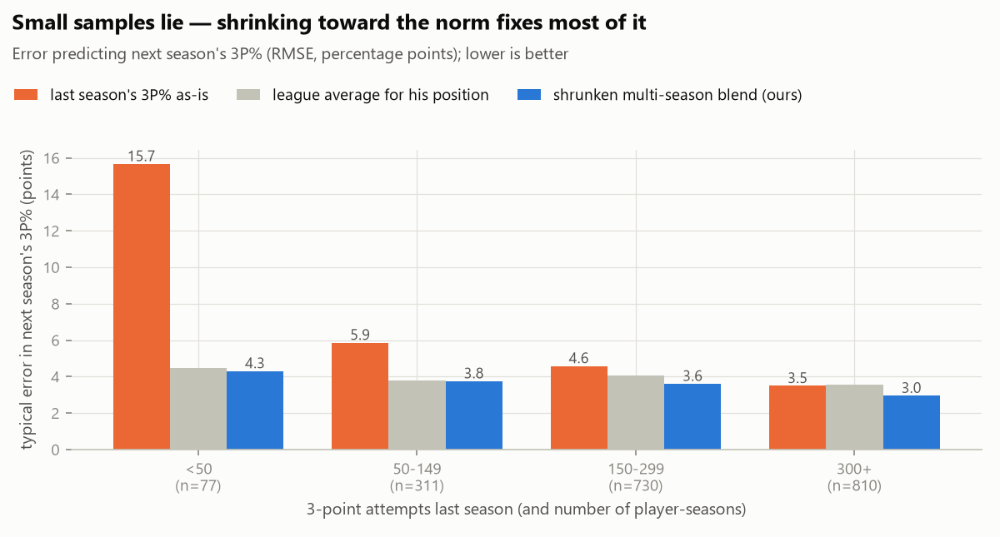

**Reading the chart.** For a player who attempted fewer than 50 threes last season, using his raw percentage is off by
15.7 points on average; the shrunken blend is off by 4.3 — a 72% reduction.
For high-volume shooters (300+) the three methods converge, because there is enough evidence to trust the player.

**Worked example — Dyson Daniels** (projected for 2026-27; the method picks the player where shrinkage matters most among 100-300-attempt shooters):

| season | 3PA | 3PM | raw 3P% | weight |
|---|---|---|---|---|
| 2025-26 | 117 | 22 | 0.188 | 1.00 |
| 2024-25 | 235 | 80 | 0.340 | 1.00 |
| 2023-24 | 135 | 42 | 0.311 | 1.00 |

* League-average 3P% for his position group: **0.363** (the prior), `k = 400`.
* Numerator = 144.0 + 400 × 0.363 = **289.2**; denominator = 487.0 + 400 = **887.0**.
* Shrunken estimate = 289.2 ÷ 887.0 = **0.326** (his last season alone said 0.188).
* The final 2026-27 projection after the learned adjustment (age, role, etc.) is **0.313**.

## 4. Phase 1 — projecting next season

### 4.1 The competition: three predictors per stat

For every stat, three candidate predictors compete:

1. **Baseline** — the shrunken, recency-weighted average from section 3.
2. **Ridge** — a regularised linear model that learns a *correction* to the baseline from age, age², experience, draft slot, position group,
   per-season minutes and availability, and the blends of all the other stats.
3. **LightGBM** — a small gradient-boosted tree model (6 leaves, 250 rounds, heavy regularisation) learning the same correction, allowed to find
   non-linear shapes such as the aging curve's bend. Percentages (2P%, 3P%, FT%) use Ridge only — shot-efficiency changes are close to linear in
   age and sample size, and trees mostly chase noise there.

Learning the *residual* (what the baseline gets wrong) rather than the stat itself keeps the models stable: with no signal, they predict "no correction".

### 4.2 The test: never grade on data the model has seen

Random train/test splits leak the future (the 2024 version of a player helps predict his 2023). We use a **rolling origin**: for each season
T in 2021…2025 train on every season before T, predict T, then pool the errors (weighted by minutes or attempts, players with ≥ 500 minutes).
The winner per stat is whichever has the lowest pooled squared error.

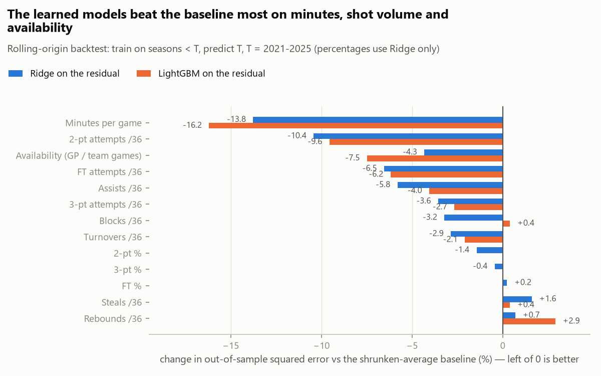

| stat | winning model | baseline RMSE | winning RMSE | MSE change |
|---|---|---|---|---|
| Assists /36 | ridge | 0.894 | 0.868 | -5.8% |
| Availability (GP / team games) | lgbm | 0.247 | 0.238 | -7.5% |
| Blocks /36 | ridge | 0.257 | 0.253 | -3.2% |
| 2-pt attempts /36 | ridge | 1.596 | 1.511 | -10.4% |
| 3-pt attempts /36 | ridge | 1.162 | 1.141 | -3.6% |
| FT % | baseline | 0.050 | 0.050 | +0.0% |
| FT attempts /36 | ridge | 0.990 | 0.957 | -6.5% |
| Minutes per game | lgbm | 4.647 | 4.254 | -16.2% |
| 2-pt % | ridge | 0.040 | 0.040 | -1.4% |
| 3-pt % | ridge | 0.037 | 0.037 | -0.4% |
| Rebounds /36 | baseline | 0.920 | 0.920 | +0.0% |
| Steals /36 | baseline | 0.261 | 0.261 | +0.0% |
| Turnovers /36 | ridge | 0.427 | 0.421 | -2.9% |

**What this says.**
* **Minutes (−16%) and availability** improve most: role and health are where trees find structure (young players' minutes rise; veterans' fall).
* **Shot volume** (2-pt/3-pt/FT attempts) and **assists/turnovers** improve moderately.
* **Rebounds, steals, and FT%** stay with the baseline — their year-to-year signal is already captured by the shrunken average, and the extra model
  only adds noise. That is a finding, not a failure: we keep the simpler model where it wins.
* Percentages move least because they are mostly luck at season scale (see the shrinkage chart).

### 4.3 What the projections look like in fantasy terms

After the rate models run, we multiply back to per-game stats and compare with a "naive" forecaster who just assumes next year = last year, on the
same player-seasons:

| category | player-seasons | avg value | MAE: our model | MAE: 'same as last year' | MAE improvement | R² model | R² last year |
|---|---|---|---|---|---|---|---|
| PTS | 1644 | 11.86 | 2.218 | 2.491 | +11.0% | 0.81 | 0.76 |
| 3PM | 1644 | 1.34 | 0.338 | 0.358 | +5.6% | 0.76 | 0.71 |
| REB | 1644 | 4.46 | 0.739 | 0.853 | +13.4% | 0.83 | 0.76 |
| AST | 1644 | 2.71 | 0.608 | 0.669 | +9.1% | 0.82 | 0.78 |
| STL | 1644 | 0.80 | 0.174 | 0.206 | +15.6% | 0.59 | 0.42 |
| BLK | 1644 | 0.49 | 0.134 | 0.159 | +15.7% | 0.78 | 0.70 |
| TO | 1644 | 1.38 | 0.299 | 0.342 | +12.4% | 0.77 | 0.70 |
| FG% | 1644 | 0.47 | 0.029 | 0.035 | +17.7% | 0.71 | 0.53 |
| FT% | 1637 | 0.77 | 0.048 | 0.063 | +23.6% | 0.52 | 0.07 |

MAE = average absolute miss in per-game units (e.g., 0.9 means a typical miss of 0.9 points / rebounds / etc.). "R²" is the share of the spread between
players the projection explains.

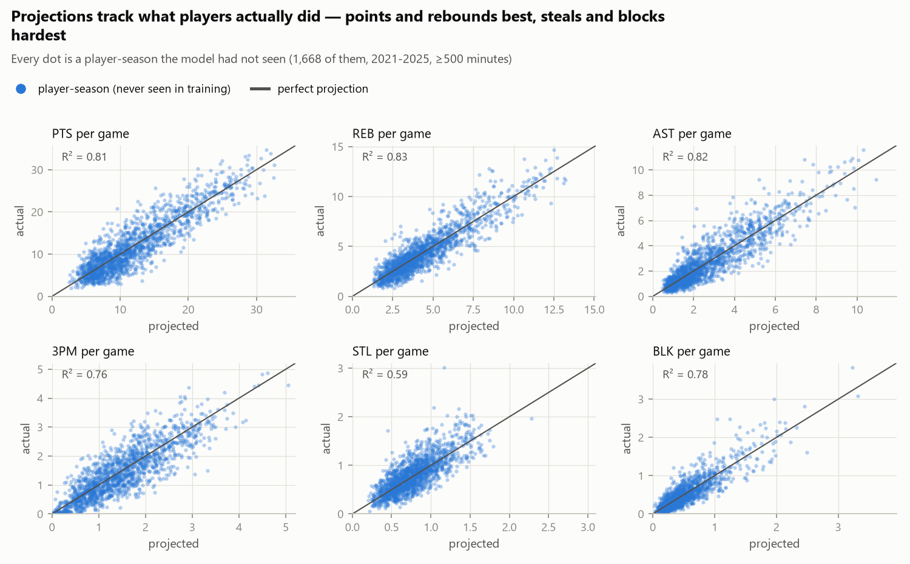

### 4.4 The test that matters for a draft: ranking

A draft only needs to *order* players. For each backtest season we z-score the nine categories for the projection and for what really happened,
then compare orderings:

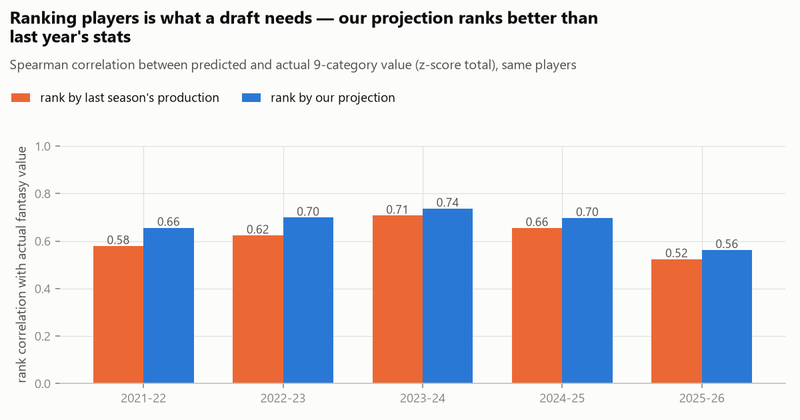

* Average rank correlation: **0.670** (ours) vs **0.618** (last season's stats).
* Of the ~50 most valuable players in a season, our projection identified on average **62%** in advance, versus
  **55%** for "last year's best".

| season start | players | rank corr (ours) | rank corr (last yr) | top-k hit (ours) | top-k hit (last yr) | k |
|---|---|---|---|---|---|---|
| 2021 | 329 | 0.656 | 0.579 | 68% | 56% | 50 |
| 2022 | 327 | 0.699 | 0.624 | 70% | 52% | 50 |
| 2023 | 322 | 0.737 | 0.707 | 64% | 66% | 50 |
| 2024 | 330 | 0.697 | 0.655 | 56% | 52% | 50 |
| 2025 | 336 | 0.563 | 0.524 | 50% | 50% | 50 |

The projection ranks better in all 5 seasons on rank correlation, but its edge in identifying the top group is uneven: it matched or beat last year's stats in
4 of 5 seasons (1 ties), which is why we do not oversell it.

**Honest limits.** Scored players are those who logged ≥ 500 minutes; someone who tore his ACL in October is invisible to this test (the
availability model is the only place that risk lives). Steals and blocks are the least predictable categories, as the R² panel shows — a pattern
that is true of the real game, not of this model.

### 4.5 Residual diagnostics: where is the model wrong?

A **residual** is *actual − projected* for a player-season the model had not seen (the same 1,668 out-of-sample player-seasons as above). Residual plots answer three questions
that a single accuracy number cannot: is the model **biased** (consistently high or low somewhere), is its **error size** steady across players, and are its **misses related** to each other?

**How to read these plots.** Dots scattered evenly above and below the zero line, with the orange average hugging zero, mean no bias. A slope in the orange line means the model
mis-handles the high or low end (e.g. a downward slope = stars are over-projected). A funnel (dots fanning out to the right) means bigger players have bigger misses.

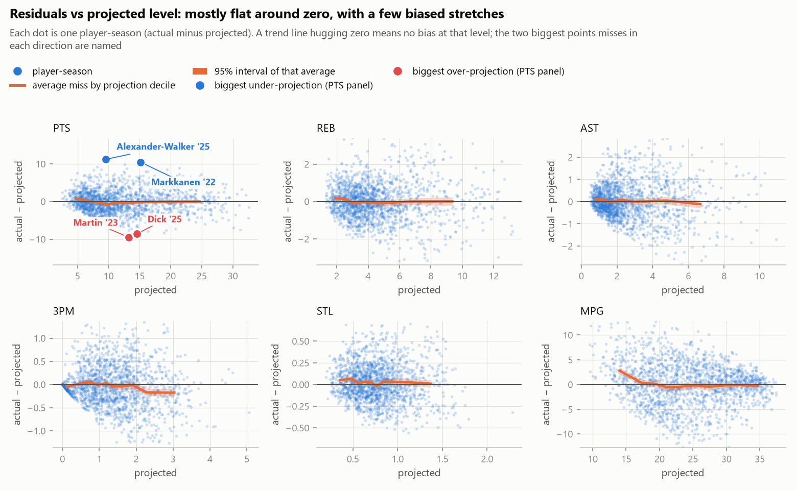

**Where the trend line leaves zero** (decile averages whose 95% interval excludes zero):

* **MPG**, players projected around 14.0: actual averaged +2.81 vs projection (n=167, 9.1 standard errors from zero)
* **PTS**, players projected around 4.8: actual averaged +0.78 vs projection (n=167, 5.7 standard errors from zero)
* **3PM**, players projected around 0.1: actual averaged -0.06 vs projection (n=167, 5.5 standard errors from zero)
* **STL**, players projected around 0.5: actual averaged +0.07 vs projection (n=167, 4.3 standard errors from zero)
* **3PM**, players projected around 3.0: actual averaged -0.18 vs projection (n=167, 4.3 standard errors from zero)
* **3PM**, players projected around 2.3: actual averaged -0.17 vs projection (n=167, 4.2 standard errors from zero)

*Reading:* a handful of stretches of ~10 can be flagged purely by chance, so only large, consistent departures matter — the table below puts the overall bias on a common footing.

| stat | n | bias (actual−proj) | ± SE | typical miss (SD) | MAE | skew | misses > 2 SD | error grows with level (ρ) |
|---|---|---|---|---|---|---|---|---|
| PTS | 1668 | -0.067 | 0.070 | 2.867 | 2.234 | +0.30 | 5.5% | +0.14 |
| 3PM | 1668 | -0.040 | 0.011 | 0.448 | 0.340 | +0.25 | 5.8% | +0.33 |
| REB | 1668 | -0.002 | 0.024 | 0.989 | 0.741 | +0.44 | 5.7% | +0.20 |
| AST | 1668 | +0.028 | 0.021 | 0.841 | 0.612 | +0.60 | 5.5% | +0.37 |
| STL | 1668 | +0.028 | 0.006 | 0.228 | 0.174 | +0.84 | 4.9% | +0.16 |
| BLK | 1668 | -0.001 | 0.005 | 0.191 | 0.134 | +1.04 | 5.3% | +0.40 |
| TO | 1668 | +0.010 | 0.010 | 0.399 | 0.301 | +0.55 | 5.4% | +0.24 |
| FG% (pts) | 1668 | -0.101 | 0.094 | 3.838 | 2.907 | +0.26 | 5.7% | +0.11 |
| FT% (pts) | 1668 | -0.470 | 0.162 | 6.607 | 4.807 | -0.79 | 5.2% | -0.19 |
| MPG | 1668 | +0.110 | 0.105 | 4.305 | 3.315 | -0.11 | 5.5% | -0.25 |

* **Overall bias.** Categories whose average miss is more than 2.5 standard errors from zero: 3PM, STL, FT%.
  Bias is in the table's own units (per game; FG%/FT% in percentage points).
* **Error grows with level (ρ).** Positive ρ means bigger projected values come with bigger absolute misses (the funnel). The strongest is BLK (ρ = +0.40); this is why
  the simulation sizes talent uncertainty *relative* to a player's level for counting stats instead of using one flat number.
* **Skew and tails.** Positive skew means occasional large positive surprises (breakouts); the share of misses beyond 2 SD (normal would be 4.6%) shows how heavy the tails are.

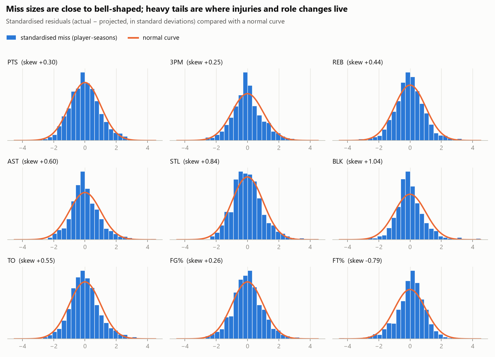

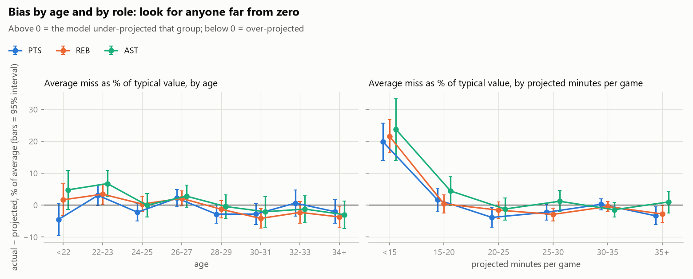

**Bias by group.** Averages far from zero here would be fixable: for example, persistent over-projection of 30+ year-olds would mean the aging curve is too gentle. Error bars are wide for
small groups (the oldest and youngest), so look for departures that are both large and consistent across the three categories.

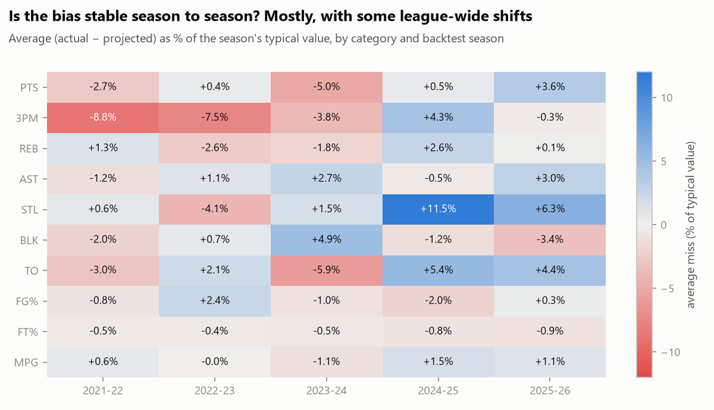

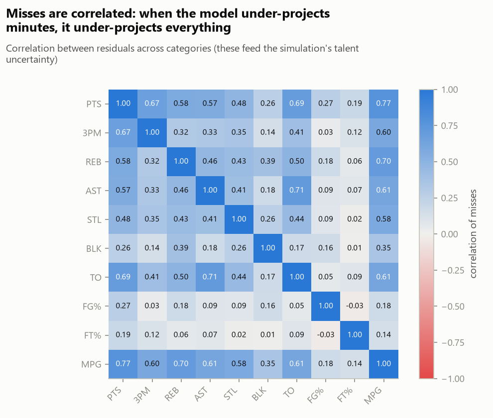

**Misses move together.** The correlation between the points miss and the minutes miss is **0.77**: most of what the model gets wrong about a player is his *role* (minutes), which then
spreads across every counting stat. That is exactly the structure the simulation's "talent draw" reproduces (section 8) — the projection's uncertainty is not nine independent errors
but mostly one shared one. It also explains why availability and minutes are the first places to look for improvement (more informative inputs such as depth-chart changes would pay off most there).

## 5. Rookies: players with no history

A player with no NBA season has nothing to blend. We use his **draft slot** as the only prior: all first-year players since 2015 are bucketed by where they
were drafted (1-5, 6-14, 15-30, 31-60, undrafted) and each bucket's average rates become the rookie's projection. Where a source you trust (for example ESPN) disagrees,
drop the number into `data/external/projection_overrides.csv` and it wins.

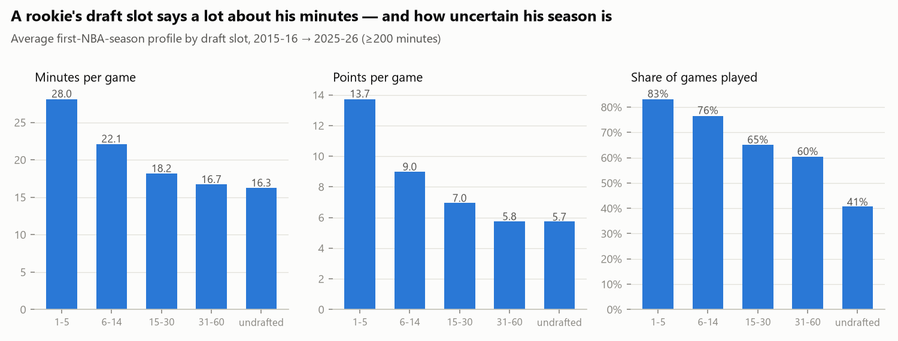

| draft slot | rookies | mpg | availability | PTS | REB | AST | STL | BLK | TO | 3PM |
|---|---|---|---|---|---|---|---|---|---|---|
| 1-5 | 53 | 28.0 | 83% | 13.7 | 5.1 | 2.9 | 0.87 | 0.66 | 1.98 | 1.23 |
| 6-14 | 95 | 22.1 | 76% | 9.0 | 3.8 | 1.8 | 0.66 | 0.45 | 1.24 | 0.97 |
| 15-30 | 142 | 18.2 | 65% | 7.0 | 3.1 | 1.5 | 0.55 | 0.36 | 0.93 | 0.82 |
| 31-60 | 148 | 16.7 | 60% | 5.8 | 2.7 | 1.5 | 0.55 | 0.33 | 0.83 | 0.61 |
| undrafted | 160 | 16.3 | 41% | 5.7 | 2.7 | 1.5 | 0.53 | 0.29 | 0.80 | 0.69 |

**Uncertainty is part of the answer.** The *coefficient of variation* (spread ÷ average) of each bucket — how much individual rookies differ from their bucket's mean
— is stored and later feeds the simulation, so a late first-rounder's range of outcomes is far wider than a top-5 pick's:

| draft slot | fga2 | fga3 | reb | ast | stl | blk | tov |
|---|---|---|---|---|---|---|---|
| 1-5 | 0.38 | 0.58 | 0.43 | 0.62 | 0.34 | 0.90 | 0.41 |
| 6-14 | 0.52 | 0.59 | 0.46 | 0.72 | 0.48 | 0.77 | 0.55 |
| 15-30 | 0.50 | 0.67 | 0.52 | 0.74 | 0.50 | 1.01 | 0.58 |
| 31-60 | 0.56 | 0.62 | 0.54 | 0.70 | 0.51 | 1.06 | 0.54 |
| undrafted | 0.54 | 0.73 | 0.52 | 0.74 | 0.63 | 0.93 | 0.55 |

**Why buckets and not a smooth curve?** We tested a smoother alternative — a regression on log(draft pick), which would separate pick #1 from pick #5 — by leaving out each
rookie class in turn and predicting it from the others (average absolute miss per game):

| method | MPG | PTS | REB | AST | STL | BLK |
|---|---|---|---|---|---|---|
| draft-slot bucket means (used) | 4.814 | 2.499 | 1.233 | 0.880 | 0.225 | 0.246 |
| smooth curve in log(pick) | 4.875 | 2.528 | 1.236 | 0.882 | 0.227 | 0.245 |

The curve is no more accurate (differences are in the third decimal, and the buckets are slightly ahead on minutes), so we keep the simpler method. **The consequence you should know about:**
every rookie in a bucket gets the *same* projection, so two top-5 picks are identical in the model, and an individual standout (or bust) can't be anticipated from draft slot alone. If you have
rookie projections you trust, put them in `data/external/projection_overrides.csv`.
Players with no NBA history who are *not* 2026 draftees (e.g. someone returning from Europe) are projected with the undrafted bucket, not the draft slot they were picked at years ago.

**The 113 players projected this way for 2026-27** (rookies + anyone without NBA history in the last three seasons); the ten most valuable:

| rank | name | draft pick | elig | mpg | pts | reb | ast | stl | blk | tov |
|---|---|---|---|---|---|---|---|---|---|---|
| 142 | Keaton Wagler | 5 | PG/SG | 28.0 | 13.7 | 5.1 | 2.9 | 0.87 | 0.66 | 1.98 |
| 143 | Caleb Wilson | 4 | SF/PF | 28.0 | 13.7 | 5.1 | 2.9 | 0.87 | 0.66 | 1.98 |
| 144 | Cameron Boozer | 3 | SF/PF | 28.0 | 13.7 | 5.1 | 2.9 | 0.87 | 0.66 | 1.98 |
| 145 | Darryn Peterson | 2 | PG/SG | 28.0 | 13.7 | 5.1 | 2.9 | 0.87 | 0.66 | 1.98 |
| 146 | AJ Dybantsa | 1 | SF/PF | 28.0 | 13.7 | 5.1 | 2.9 | 0.87 | 0.66 | 1.98 |
| 262 | Darius Acuff Jr. | 7 | SG | 22.1 | 9.0 | 3.8 | 1.8 | 0.66 | 0.45 | 1.24 |
| 263 | Kingston Flemings | 8 | SG | 22.1 | 9.0 | 3.8 | 1.8 | 0.66 | 0.45 | 1.24 |
| 264 | Aday Mara | 12 | C | 22.1 | 9.0 | 3.8 | 1.8 | 0.66 | 0.45 | 1.24 |
| 265 | Mikel Brown Jr. | 6 | SG | 22.1 | 9.0 | 3.8 | 1.8 | 0.66 | 0.45 | 1.24 |
| 266 | Yaxel Lendeborg | 11 | SF/PF | 22.1 | 9.0 | 3.8 | 1.8 | 0.66 | 0.45 | 1.24 |

## 6. The 2026-27 projections

Per-game projections for every one of the 614 players on a 2026-27 roster. **Value** is the sum of nine z-scores (how many standard deviations
better than a typical *drafted* player in each category; turnovers flipped; FG%/FT% weighted by volume, so a 60% shooter on 3 attempts matters less than a 52%
shooter on 15; every count scaled by expected availability). It's the starting ranking — the draft engine in section 8 goes beyond it.

| # | Player | Pos | Age | MPG | GP% | PTS | 3PM | REB | AST | STL | BLK | FG% | FT% | TO | Value |
|---|---|---|---|---|---|---|---|---|---|---|---|---|---|---|---|
| 1 | Shai Gilgeous-Alexander | PG | 28 | 33.9 | 79 | 31.4 | 1.8 | 4.7 | 6.9 | 1.6 | 0.8 | 0.530 | 0.882 | 2.6 | 12.5 |
| 2 | Nikola Jokić | C | 32 | 34.4 | 77 | 26.1 | 1.6 | 12.4 | 10.0 | 1.4 | 0.7 | 0.553 | 0.814 | 3.6 | 11.1 |
| 3 | Victor Wembanyama | PF/C | 23 | 31.7 | 67 | 26.0 | 2.1 | 11.7 | 3.5 | 1.1 | 3.1 | 0.512 | 0.819 | 2.8 | 9.5 |
| 4 | Tyrese Maxey | PG | 26 | 37.4 | 72 | 27.4 | 3.2 | 3.9 | 6.5 | 1.6 | 0.6 | 0.457 | 0.880 | 2.5 | 6.3 |
| 5 | Scottie Barnes | SG/SF | 25 | 33.6 | 80 | 19.6 | 1.2 | 7.6 | 6.0 | 1.4 | 1.3 | 0.503 | 0.789 | 2.7 | 5.6 |
| 6 | Luka Dončić | PG/SG/SF | 28 | 35.4 | 72 | 30.7 | 3.5 | 7.9 | 8.2 | 1.6 | 0.5 | 0.467 | 0.781 | 3.8 | 5.4 |
| 7 | Donovan Mitchell | PG | 30 | 32.6 | 74 | 25.4 | 3.2 | 4.5 | 5.6 | 1.4 | 0.3 | 0.470 | 0.851 | 2.6 | 4.6 |
| 8 | Amen Thompson | SG/SF | 24 | 35.3 | 82 | 18.6 | 0.6 | 7.8 | 5.3 | 1.5 | 0.8 | 0.542 | 0.752 | 2.4 | 4.4 |
| 9 | Jamal Murray | PG | 30 | 34.5 | 75 | 23.3 | 3.0 | 4.2 | 6.6 | 1.0 | 0.4 | 0.468 | 0.878 | 2.3 | 4.2 |
| 10 | Kawhi Leonard | SF/PF | 36 | 31.0 | 68 | 23.3 | 2.3 | 6.0 | 3.5 | 1.6 | 0.5 | 0.492 | 0.872 | 1.9 | 4.2 |
| 11 | Trey Murphy III | SF/PF | 27 | 35.0 | 73 | 21.3 | 3.3 | 5.6 | 3.8 | 1.3 | 0.5 | 0.466 | 0.867 | 1.8 | 3.9 |
| 12 | Kon Knueppel | SG/SF | 21 | 33.7 | 85 | 21.7 | 3.6 | 5.7 | 4.2 | 0.8 | 0.3 | 0.465 | 0.854 | 2.3 | 3.8 |
| 13 | Karl-Anthony Towns | PF/C | 31 | 31.1 | 75 | 20.3 | 1.8 | 11.4 | 3.2 | 0.8 | 0.6 | 0.507 | 0.843 | 2.4 | 3.7 |
| 14 | Desmond Bane | PG/SG | 29 | 33.1 | 79 | 20.3 | 2.4 | 4.6 | 4.6 | 1.1 | 0.4 | 0.481 | 0.893 | 2.1 | 3.6 |
| 15 | Derrick White | PG/SG | 32 | 32.4 | 80 | 16.2 | 3.0 | 4.2 | 4.9 | 1.0 | 1.0 | 0.428 | 0.876 | 1.7 | 3.4 |
| 16 | Anthony Edwards | PG/SG | 25 | 35.7 | 72 | 28.2 | 3.3 | 5.3 | 4.6 | 1.3 | 0.7 | 0.464 | 0.817 | 3.0 | 3.4 |
| 17 | Kevin Durant | SF/PF | 38 | 34.7 | 75 | 23.8 | 2.2 | 5.4 | 4.5 | 0.8 | 1.0 | 0.501 | 0.856 | 2.9 | 3.3 |
| 18 | VJ Edgecombe | PG/SG | 21 | 35.7 | 81 | 19.0 | 2.3 | 5.7 | 4.8 | 1.4 | 0.5 | 0.450 | 0.817 | 2.1 | 3.3 |
| 19 | Jalen Duren | C | 23 | 28.9 | 78 | 18.7 | 0.1 | 10.9 | 2.9 | 0.8 | 0.9 | 0.643 | 0.732 | 2.1 | 3.2 |
| 20 | Jalen Johnson | PF | 25 | 35.0 | 72 | 21.7 | 1.6 | 10.0 | 6.9 | 1.3 | 0.6 | 0.496 | 0.775 | 3.1 | 3.2 |
| 21 | Cooper Flagg | SF/PF | 20 | 34.4 | 72 | 24.1 | 1.4 | 6.8 | 5.1 | 1.2 | 0.9 | 0.485 | 0.820 | 2.6 | 3.2 |
| 22 | Dyson Daniels | PG | 24 | 32.1 | 79 | 12.9 | 0.7 | 6.2 | 5.6 | 2.1 | 0.6 | 0.511 | 0.647 | 2.0 | 3.2 |
| 23 | Cade Cunningham | PG | 25 | 34.5 | 70 | 25.3 | 2.1 | 5.6 | 9.5 | 1.2 | 0.7 | 0.470 | 0.829 | 3.8 | 3.1 |
| 24 | James Harden | PG | 37 | 33.2 | 77 | 20.6 | 2.8 | 4.8 | 7.7 | 1.2 | 0.5 | 0.424 | 0.876 | 3.3 | 3.1 |
| 25 | Bam Adebayo | PF/C | 29 | 32.2 | 81 | 18.6 | 1.5 | 9.7 | 3.6 | 1.1 | 0.7 | 0.470 | 0.767 | 1.9 | 3.0 |
| 26 | Chet Holmgren | PF/C | 25 | 29.4 | 70 | 17.6 | 1.4 | 8.8 | 2.1 | 0.7 | 1.9 | 0.542 | 0.779 | 1.7 | 2.9 |
| 27 | Mikal Bridges | SG/SF | 30 | 33.2 | 86 | 15.8 | 2.1 | 3.6 | 3.8 | 1.1 | 0.6 | 0.478 | 0.818 | 1.4 | 2.6 |
| 28 | Alperen Sengun | C | 24 | 33.3 | 80 | 20.8 | 0.6 | 9.5 | 6.0 | 1.2 | 0.9 | 0.524 | 0.693 | 3.0 | 2.4 |
| 29 | Evan Mobley | C | 26 | 31.6 | 74 | 18.3 | 1.0 | 9.2 | 3.6 | 0.8 | 1.6 | 0.557 | 0.664 | 2.0 | 2.2 |
| 30 | Donovan Clingan | C | 23 | 26.9 | 80 | 12.3 | 0.9 | 11.2 | 2.2 | 0.6 | 1.6 | 0.534 | 0.669 | 1.5 | 2.2 |
| 31 | Nickeil Alexander-Walker | PG/SG | 28 | 30.4 | 85 | 17.2 | 2.8 | 3.3 | 3.6 | 1.1 | 0.5 | 0.447 | 0.868 | 1.8 | 2.2 |
| 32 | Anthony Davis | PF/C | 34 | 30.0 | 62 | 19.7 | 0.6 | 10.3 | 2.8 | 1.0 | 1.7 | 0.540 | 0.782 | 1.9 | 2.1 |
| 33 | Devin Booker | PG | 30 | 33.9 | 74 | 25.0 | 2.2 | 3.9 | 6.3 | 0.9 | 0.3 | 0.467 | 0.878 | 2.9 | 2.0 |
| 34 | Onyeka Okongwu | PF/C | 26 | 29.5 | 78 | 14.7 | 1.5 | 7.7 | 2.9 | 1.0 | 1.0 | 0.501 | 0.763 | 1.6 | 1.7 |
| 35 | Payton Pritchard | PG/SG | 29 | 30.1 | 87 | 16.1 | 2.9 | 3.8 | 4.7 | 0.8 | 0.1 | 0.462 | 0.861 | 1.4 | 1.7 |
| 36 | Jalen Brunson | PG | 30 | 34.1 | 77 | 25.2 | 2.6 | 3.2 | 6.7 | 0.9 | 0.1 | 0.468 | 0.835 | 2.5 | 1.7 |
| 37 | OG Anunoby | SG/SF | 29 | 33.3 | 74 | 16.2 | 2.3 | 4.9 | 2.3 | 1.4 | 0.8 | 0.475 | 0.810 | 1.5 | 1.7 |
| 38 | Derik Queen | C | 22 | 27.2 | 85 | 14.4 | 0.6 | 7.7 | 4.3 | 1.1 | 0.9 | 0.504 | 0.783 | 2.4 | 1.7 |
| 39 | Cason Wallace | PG/SG | 23 | 28.1 | 83 | 10.5 | 1.5 | 3.3 | 3.1 | 1.8 | 0.5 | 0.449 | 0.809 | 1.1 | 1.4 |
| 40 | Kel'el Ware | C | 23 | 24.4 | 79 | 12.0 | 1.1 | 9.4 | 1.2 | 0.8 | 1.1 | 0.529 | 0.723 | 1.1 | 1.4 |

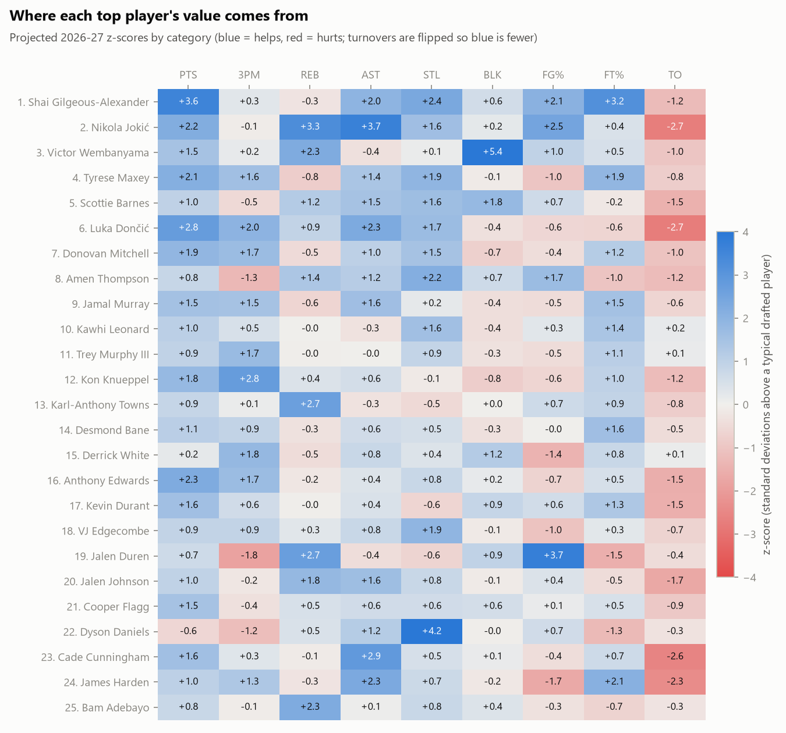

*How to read the heatmap:* row = player, column = category. A deep blue cell is a category where he gives you a big edge; deep red is where he costs you.
The shape of a row is the player's **archetype** — Jokić is blue almost everywhere except turnovers; Wembanyama's value is concentrated in blocks, rebounds and points.
The engine uses these shapes: a team with too many players of the same shape wins fewer categories.

## 7. Biggest projected risers and fallers

Comparing the 2026-27 projection with what each player *actually* did in 2025-26. Both seasons are z-scored among the same 275 players who logged ≥1,000 minutes last year, so the scales
match. Two lenses, because a player's fantasy value changes for two different reasons — he plays better or worse, or he plays more or fewer games:

### 7.1 Total fantasy value (what you actually draft)

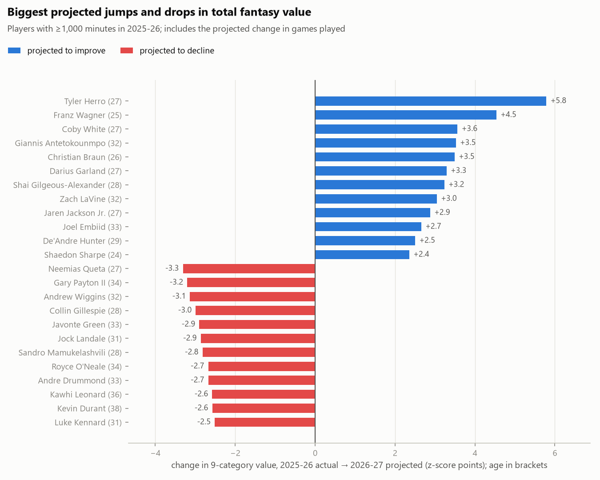

**Risers**

| Player | Age | Pos | Rank 25-26 | Rank 26-27 | Δ value | MPG | GP | Biggest category swings |
|---|---|---|---|---|---|---|---|---|
| Tyler Herro | 27 | PG/SG | 226 | 48 | +5.8 | 31.2 → 32.1 | 33 → 57 | +PTS, +3PM |
| Franz Wagner | 25 | SF/PF | 238 | 79 | +4.5 | 30.0 → 30.6 | 34 → 52 | +PTS, +STL |
| Coby White | 27 | PG/SG | 249 | 116 | +3.6 | 25.0 → 28.8 | 50 → 58 | +PTS, +STL |
| Giannis Antetokounmpo | 32 | PF | 221 | 90 | +3.5 | 28.9 → 29.0 | 36 → 53 | -FT%, +REB |
| Christian Braun | 26 | PG/SG | 237 | 105 | +3.5 | 31.8 → 30.2 | 44 → 58 | +STL, +PTS |
| Darius Garland | 27 | PG | 195 | 80 | +3.3 | 29.8 → 29.2 | 45 → 57 | +STL, +AST |
| Shai Gilgeous-Alexander | 28 | PG | 2 | 1 | +3.2 | 33.2 → 33.9 | 68 → 65 | +STL, +PTS |
| Zach LaVine | 32 | SG | 234 | 118 | +3.0 | 31.4 → 31.0 | 39 → 54 | +3PM, +PTS |
| Jaren Jackson Jr. | 27 | PF/C | 121 | 53 | +2.9 | 30.3 → 29.4 | 48 → 55 | +STL, +BLK |
| Joel Embiid | 33 | PF/C | 140 | 72 | +2.7 | 31.5 → 28.9 | 38 → 46 | +REB, +FG% |
| De'Andre Hunter | 29 | SG/SF | 268 | 171 | +2.5 | 26.2 → 24.8 | 45 → 55 | +3PM, +PTS |
| Shaedon Sharpe | 24 | PG/SG | 214 | 120 | +2.4 | 29.4 → 29.9 | 50 → 57 | +PTS, +3PM |

**Fallers**

| Player | Age | Pos | Rank 25-26 | Rank 26-27 | Δ value | MPG | GP | Biggest category swings |
|---|---|---|---|---|---|---|---|---|
| Neemias Queta | 27 | C | 34 | 93 | -3.3 | 25.4 → 22.7 | 76 → 59 | -REB, -BLK |
| Gary Payton II | 34 | PG/SG | 145 | 255 | -3.2 | 15.6 → 14.1 | 73 → 52 | -STL, -PTS |
| Andrew Wiggins | 32 | SF/PF | 52 | 136 | -3.1 | 30.4 → 27.5 | 68 → 56 | -STL, -PTS |
| Collin Gillespie | 28 | PG/SG | 43 | 102 | -3.0 | 28.5 → 27.0 | 80 → 57 | -STL, -PTS |
| Javonte Green | 33 | SG | 105 | 207 | -2.9 | 17.6 → 17.8 | 82 → 57 | -STL, -PTS |
| Jock Landale | 31 | C | 166 | 257 | -2.9 | 22.2 → 18.4 | 68 → 51 | -PTS, -REB |
| Sandro Mamukelashvili | 28 | PF/C | 69 | 145 | -2.8 | 21.9 → 20.7 | 80 → 62 | -PTS, -STL |
| Royce O'Neale | 34 | SF/PF | 71 | 148 | -2.7 | 28.4 → 24.7 | 78 → 62 | -STL, -3PM |
| Andre Drummond | 33 | C | 188 | 261 | -2.7 | 19.6 → 16.7 | 63 → 45 | -REB, -PTS |
| Kawhi Leonard | 36 | SF/PF | 5 | 9 | -2.6 | 32.1 → 31.0 | 65 → 56 | -PTS, -FT% |
| Kevin Durant | 38 | SF/PF | 8 | 18 | -2.6 | 36.4 → 34.7 | 78 → 61 | -PTS, +TO |
| Luke Kennard | 31 | PG/SG | 125 | 213 | -2.5 | 21.6 → 20.9 | 78 → 56 | -FG%, -PTS |

*MPG and GP show last season's actual → this season's projection; "Biggest category swings" are the two categories where his z-score moves most.*

**What drives these moves.** 11 of the 12 risers played fewer than 60 games last year — the model projects a return toward a normal share of games, which lifts every counting stat at once.
9 of the 12 fallers are 31 or older, and 1 of the 12 risers are 24 or younger. So these lists mix two forces; the next lens separates them.

### 7.2 Per-game production only (games played held equal)

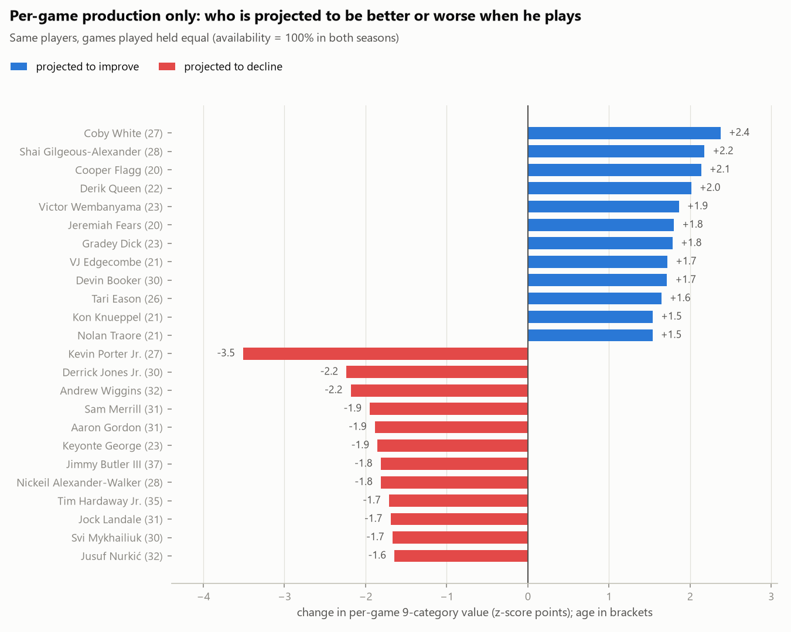

**Biggest per-game risers**

| Player | Age | Pos | Rank 25-26 | Rank 26-27 | Δ value | MPG | GP | Biggest category swings |
|---|---|---|---|---|---|---|---|---|
| Coby White | 27 | PG/SG | 208 | 120 | +2.4 | 25.0 → 28.8 | 50 → 58 | +FT%, +STL |
| Shai Gilgeous-Alexander | 28 | PG | 3 | 2 | +2.2 | 33.2 → 33.9 | 68 → 65 | +STL, +FT% |
| Cooper Flagg | 20 | SF/PF | 34 | 15 | +2.1 | 33.6 → 34.4 | 70 → 59 | +PTS, +FG% |
| Derik Queen | 22 | C | 123 | 60 | +2.0 | 25.0 → 27.2 | 81 → 70 | +FG%, +PTS |
| Victor Wembanyama | 23 | PF/C | 2 | 1 | +1.9 | 29.2 → 31.7 | 64 → 55 | +BLK, -TO |
| Jeremiah Fears | 20 | PG/SG | 183 | 119 | +1.8 | 25.7 → 27.9 | 82 → 69 | +PTS, +STL |
| Gradey Dick | 23 | SG/SF | 278 | 245 | +1.8 | 14.0 → 20.0 | 76 → 59 | +3PM, +PTS |
| VJ Edgecombe | 21 | PG/SG | 56 | 28 | +1.7 | 35.0 → 35.7 | 75 → 66 | +PTS, -TO |
| Devin Booker | 30 | PG | 61 | 32 | +1.7 | 33.6 → 33.9 | 64 → 61 | +FG%, +3PM |
| Tari Eason | 26 | SF/PF | 146 | 82 | +1.6 | 25.9 → 25.3 | 60 → 54 | +STL, +FG% |
| Kon Knueppel | 21 | SG/SF | 62 | 35 | +1.5 | 31.5 → 33.7 | 81 → 70 | +PTS, -TO |
| Nolan Traore | 21 | PG | 274 | 248 | +1.5 | 22.2 → 23.5 | 56 → 50 | +FG%, +PTS |

**Biggest per-game fallers**

| Player | Age | Pos | Rank 25-26 | Rank 26-27 | Δ value | MPG | GP | Biggest category swings |
|---|---|---|---|---|---|---|---|---|
| Kevin Porter Jr. | 27 | PG/SG/SF | 14 | 65 | -3.5 | 33.2 → 26.4 | 38 → 54 | -STL, -AST |
| Derrick Jones Jr. | 30 | SF | 134 | 218 | -2.2 | 26.9 → 22.2 | 50 → 54 | -BLK, -STL |
| Andrew Wiggins | 32 | SF/PF | 57 | 117 | -2.2 | 30.4 → 27.5 | 68 → 56 | -STL, -BLK |
| Sam Merrill | 31 | SG | 143 | 211 | -1.9 | 26.5 → 21.7 | 52 → 50 | -3PM, -PTS |
| Aaron Gordon | 31 | SF/PF | 118 | 184 | -1.9 | 27.9 → 25.4 | 36 → 51 | -3PM, -PTS |
| Keyonte George | 23 | PG | 36 | 76 | -1.9 | 33.1 → 32.0 | 54 → 60 | -STL, -FG% |
| Jimmy Butler III | 37 | SF/PF | 19 | 40 | -1.8 | 31.2 → 28.6 | 38 → 51 | -PTS, -STL |
| Nickeil Alexander-Walker | 28 | PG/SG | 25 | 55 | -1.8 | 33.4 → 30.4 | 78 → 70 | -STL, -PTS |
| Tim Hardaway Jr. | 35 | SG | 177 | 241 | -1.7 | 26.6 → 24.1 | 80 → 67 | -PTS, -3PM |
| Jock Landale | 31 | C | 186 | 249 | -1.7 | 22.2 → 18.4 | 68 → 51 | -PTS, -STL |
| Svi Mykhailiuk | 30 | SG/SF | 229 | 270 | -1.7 | 23.1 → 19.4 | 50 → 46 | -FG%, -PTS |
| Jusuf Nurkić | 32 | C | 108 | 167 | -1.6 | 26.4 → 21.8 | 41 → 48 | -STL, -REB |

8 of these 12 risers are 24 or younger and 9 of the 12 fallers are 30 or older: with availability out of the picture, the age signal is the dominant one.

### 7.3 Where the model's three forces show up

1. **Availability.** Players who missed a lot of games last year are projected to play more (and the reverse). It mostly moves the *total value* list above.
2. **Aging.** Learned from data, not hand-drawn:

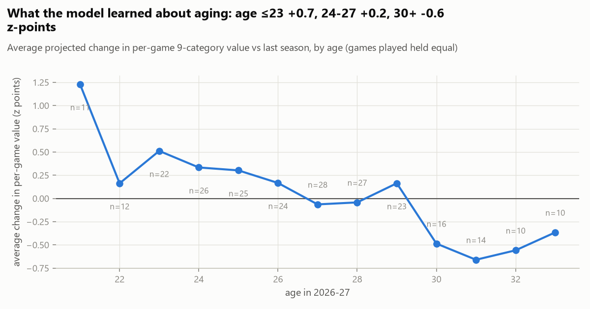

3. **Regression to the mean.** Last season's outliers (hot 3-point shooting, a career-high in steals) are pulled toward what similar players sustain. The scatter's slope of
   0.94 (<1) is that effect in one number: the projected ordering is a flatter version of last year's.

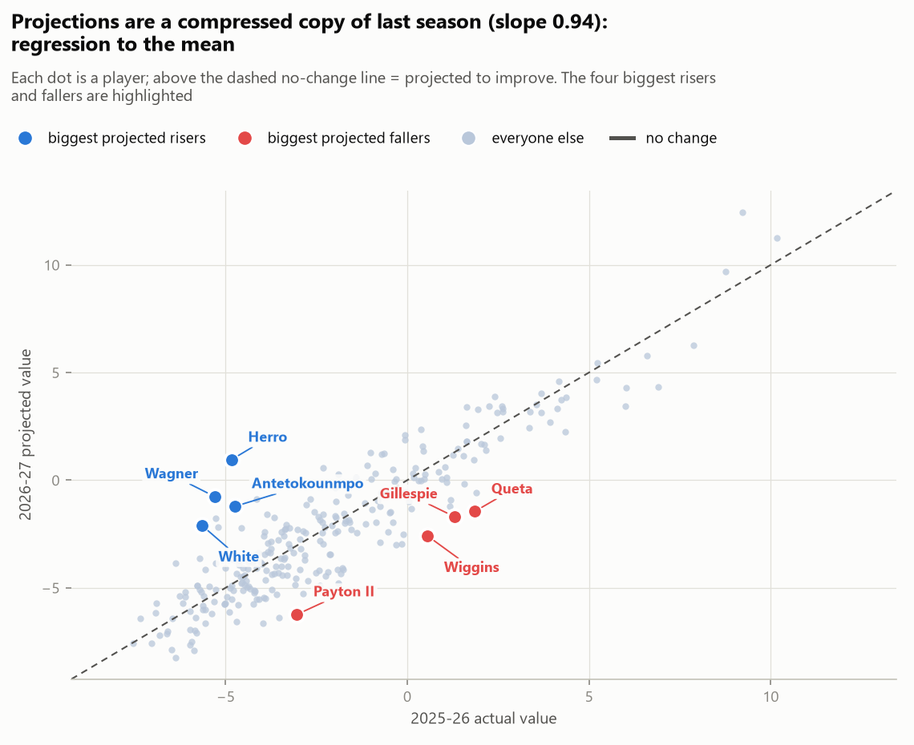

**Caveat.** These are *projected averages*, not predictions of any specific event: a faller is not predicted to be bad, and a riser is not guaranteed to improve. The engine in section 9 accounts
for that uncertainty directly (section 8) rather than trusting the averages blindly.

## 8. Phase 2 — from an average to a distribution of weeks

A league matchup is decided by one week, and a week is noisy. Two players with the same season average can have very different weekly spreads (a star who never
misses vs. one who misses 40% of weeks). The simulation turns each projected average into thousands of realistic **weeks**.

### 8.1 Step by step, for one player-week

1. **Pick a real matchup period** of your league's 2026-27 calendar (so we know which days his team plays — see 8.2). Each period counts equally, whether it is one week or two.
2. **Talent draw.** The projection is only a best guess, so perturb it: each stat's per-game average is multiplied by a random factor whose spread was measured from the
   backtest residuals (≈15-30% for counting stats for veterans, much wider for rookies by draft slot), with correlated shocks (a player who gets more minutes gets more of everything).
3. **Availability.** With probability `c·(1−avail)` he misses the entire week (injury run; `c = 0.72` is the measured share of missed games that come in whole-week runs).
   Otherwise he plays each scheduled game with the probability that makes his expected games = `avail × team games`.
4. **For each game he plays, draw a stat line** with a Gaussian copula: draw 11 correlated standard normals, turn each into a uniform with the normal CDF, then push each
   through its stat's own distribution (inverse CDF):
   * counts (2-pt attempts, 3-pt attempts, FT attempts, rebounds, assists, steals, blocks, turnovers) → **Negative Binomial** (variance bigger than the mean — real counts are streaky);
   * makes → **Binomial(attempts, make-rate)** with the make-rate's quantile driven by its own copula dimension.
5. **Compute points and percentages from the shots**: `PTS = 2·FGM + 3PM + FTM`. They are never simulated on their own.

| stat | NB size r | extra variance vs Poisson |
|---|---|---|
| fga2 | 15.6 | 0.064 |
| fga3 | 23.4 | 0.043 |
| fta | 3.1 | 0.325 |
| reb | 10.5 | 0.095 |
| ast | 12.6 | 0.079 |
| stl | 9.7 | 0.103 |
| blk | 6.5 | 0.154 |
| tov | 33.5 | 0.030 |

*(Smaller r = more streaky. Free throws attempts, `r = 3.1`, are the most volatile count; turnovers, `r = 33`, the most Poisson-like.)*

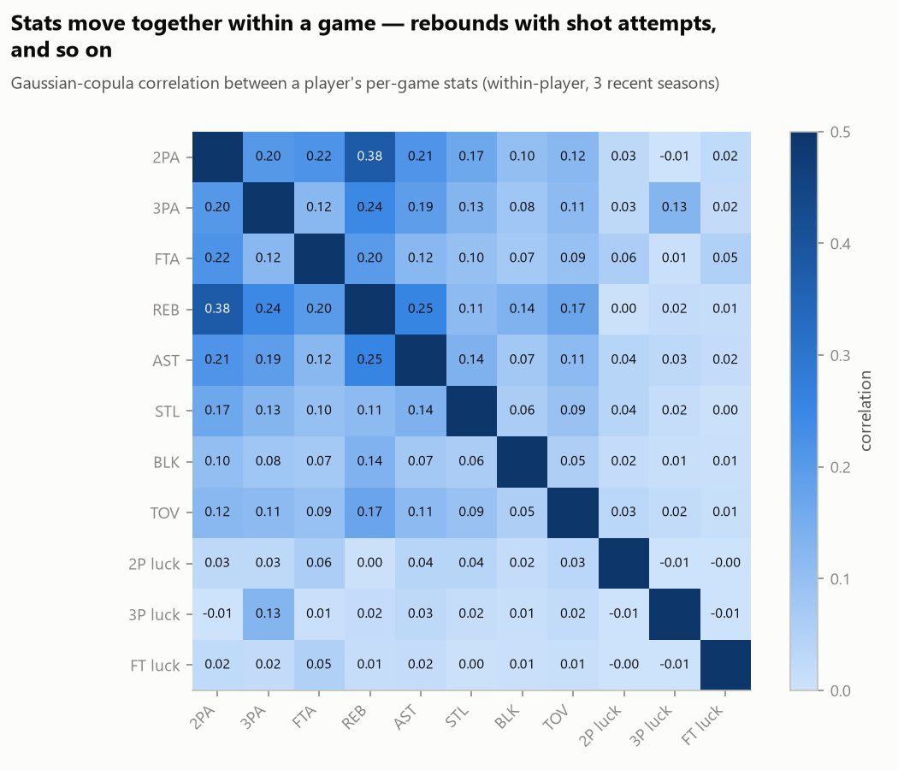

### 8.2 Your league's matchup periods

Matchup periods are Mon–Sun weeks, with two exceptions that your league makes and that the code reproduces from the schedule itself: the **NBA Cup knockout week** is merged with the week
before it, and the **All-Star break** is a two-week matchup. For 2026-27 that gives week 1 = Oct 19–25, week 2 = Oct 26–Nov 1, …, **week 7 = Nov 30–Dec 13** (Cup), …, **week 17 = Feb 15–28**
(All-Star), week 18 = Mar 1–7 (end of the regular season), then the three playoff weeks Mar 8–28 — exactly your "18 + 3". The engine's objective is the 18 regular-season periods
(`build_library.py --include-playoffs` adds the playoff weeks).

Two consequences of the two-week matchups. Counting totals roughly double while percentages and the winner-take-all result stay the same, so those weeks are *less random* — a few lucky games
matter less. **Week 7 is the opposite case**: the NBA Cup week is thin and its game counts are unusual, and teams that go deep in the Cup play on different days from eliminated teams. The published schedule
still lacks about 30 Cup games (every team shows 80 of its 82), and we deliberately **ignore** them: week 7 is simulated with only its published games and the rest is left to the simulation's
randomness (`--fill-cup-games` would instead place each team's missing games on random Cup-week days, but that is off by default). Treat week 7 as the noisiest week of the season.

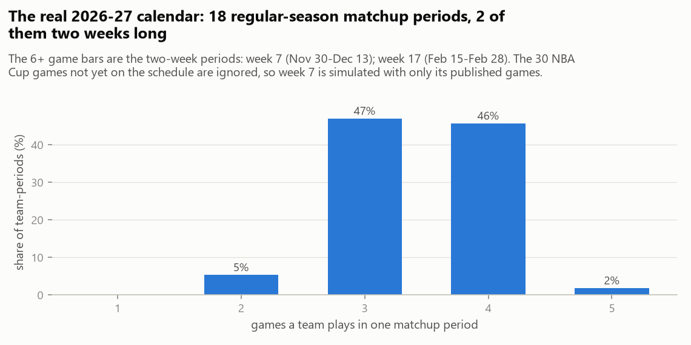

Using the real schedule matters because roster value depends on *which days* players play. On a day when your four centers all have games, only a limited number can start; a week in which
your stars happen to share off-days leaves lineup spots empty. That interaction cannot be seen in a season-average projection.

### 8.3 What a simulated player looks like

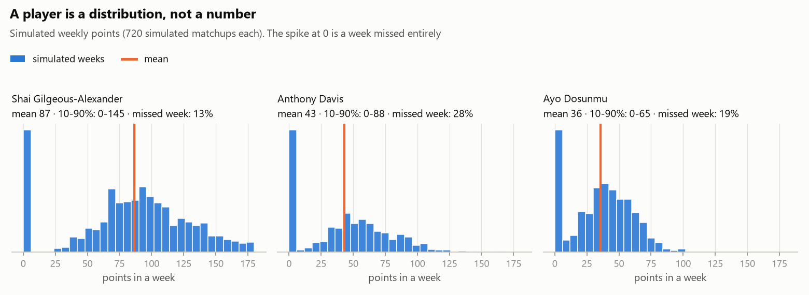

| player | avail | mean | 10th pct | 90th pct | weeks missed entirely |
|---|---|---|---|---|---|
| Shai Gilgeous-Alexander | 79% | 87 | 0 | 145 | 13% |
| Anthony Davis | 62% | 43 | 0 | 88 | 28% |
| Ayo Dosunmu | 73% | 36 | 0 | 65 | 19% |

**One simulated draw of Shai Gilgeous-Alexander for the two-week All-Star matchup (week 17, Feb 15 – Feb 28);** each row is a game he played in this draw:

| date | PTS | FG | 3PM | FT | REB | AST | STL | BLK | TO |
|---|---|---|---|---|---|---|---|---|---|
| Mon Feb 15 | 33 | 14-21 | 1 | 4-4 | 4 | 15 | 2 | 0 | 0 |
| Wed Feb 17 | 45 | 12-21 | 1 | 20-23 | 6 | 9 | 1 | 2 | 1 |
| Thu Feb 25 | 33 | 13-24 | 2 | 5-5 | 10 | 8 | 6 | 1 | 4 |
| Sat Feb 27 | 31 | 13-20 | 3 | 2-3 | 2 | 11 | 1 | 1 | 2 |

### 8.4 Does the simulation match reality?

We rebuilt the whole pipeline as of the 2025-26 preseason — projections *and* simulation fitted using only seasons before 2025-26 — and compared the simulated weekly distributions
with what really happened, game by game:

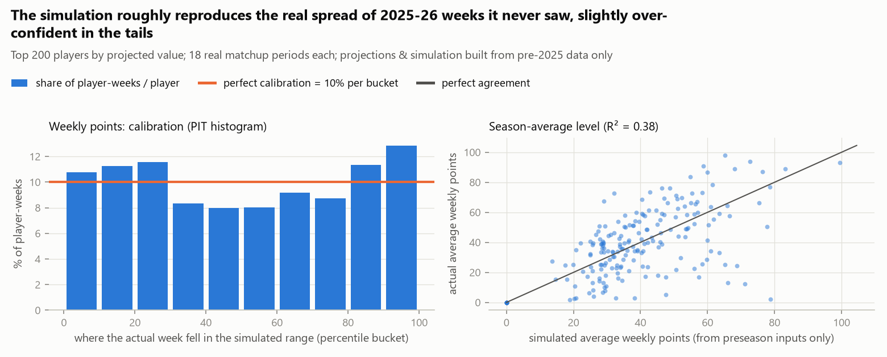

| category | actual inside simulated 10-90% band | simulated avg / week | actual avg / week | actual SD ÷ simulated SD |
|---|---|---|---|---|
| PTS | 85% | 39.51 | 39.14 | 0.98 |
| REB | 89% | 13.68 | 13.14 | 0.94 |
| AST | 88% | 8.91 | 8.63 | 0.96 |
| 3PM | 90% | 4.47 | 4.25 | 0.94 |
| STL | 91% | 2.38 | 2.46 | 1.00 |
| BLK | 94% | 1.56 | 1.47 | 0.93 |
| TO | 88% | 4.44 | 4.49 | 0.98 |

**How to read it.** The left panel is a *PIT histogram*: for every player-week, where did the actual week fall within the simulated distribution for that same player and week?
If the simulation is well calibrated each 10%-wide bucket holds 10% of weeks. Bars piled at both ends mean actual weeks are more extreme than simulated (the simulation is over-confident);
a hump in the middle would mean it is too wide. Here the lowest bucket holds **10.8%** and the highest **12.8%** (nominal 10%), and the middle two hold
16.0% (nominal 20%): close to flat, with a modest excess in the upper tail — more breakout weeks than the simulation expects. (The "10-90% band" column is a cruder
check: it counts a zero-game week as "inside" whenever the band's lower edge is zero, so it flatters the result for stars with real injury risk; the PIT handles ties properly.)
The right panel is the simulation's idea of each player's *level*, built before the season, against what he did: much of the scatter is availability (injuries) and breakouts/declines that no
preseason model can see, which is why the R² is far lower than for per-game stats.

**A bug this check caught.** The first version of this check looked clearly worse: the lowest and highest buckets held 15.8% and 15.2% in 2025-26 (distance from flat 28 points, vs
16 now). Widening the projection uncertainty did not help — the heavy lower tail stayed — which pointed at availability, not talent. The cause: the share of missed games that come in
whole-week absences (`c`) had been estimated only from players with ≥25 games and only between their first and last appearance, which silently excluded the long and season-ending
injuries. Re-measured over every week of the season for every rotation player, `c` rose from 0.42 to 0.72, which reproduces the real 18-21% of zero-game weeks, and the
distance from flat fell to roughly half in every season tested (2023: 14.5 → 7.3, 2024: 17.4 → 8.3, 2025: 27.8 → 15.6). Everything in this document was regenerated after that fix, and the
historical validation in section 10 was re-run on the corrected simulation.

## 9. Phase 3 — turning distributions into a draft decision

### 9.1 The objective

Your league is decided week by week: the team with more categories wins the matchup, and by how much doesn't matter. So the engine does not maximise "total z-score"; it maximises
**the probability my team wins a weekly matchup**, measured by playing my roster against every other roster over ~800 simulated weeks.
That is different in useful ways: it rewards *balance* (winning 5 categories narrowly every week beats winning 3 by a mile), rewards *depth* (daily lineups mean bench players score
whenever a starter is off), and treats a category you are certain to lose as nearly free to ignore (punting).

### 9.2 The decision loop (what happens when you click "recommend")

For each of the ~25 strongest available candidates:

1. Assume I take him with my pick.
2. **Roll the rest of the draft forward.** Every other team picks the best remaining player by (ESPN ADP if available, else our value rank) plus noise that grows deeper in the draft, skipping
   any center that would be a fourth on that roster. My own later picks follow our value rank.
3. **Play all ten rosters through the simulated weeks with daily lineups.** Each day, in value order, every player with a game takes the first open slot he is eligible for:
   his dedicated position (PG/SG/SF/PF/C), then G (PG or SG) or F (SF or PF), then UTIL (three of those); the rest sit. A starter without a game, or out injured, leaves a hole the bench fills.
4. Compare my weekly totals with each opponent's, category by category (turnovers: fewer wins; FG%/FT% from summed makes ÷ attempts). More than 4.5 categories = a win.
5. Repeat with a second, different set of bot choices (same random numbers for every candidate, so *differences* between candidates are far less noisy than the absolute levels).

The candidate with the highest average win probability is recommended; the table also shows per-category win chances so you can see **why**.

### 9.3 Worked example: the first overall pick

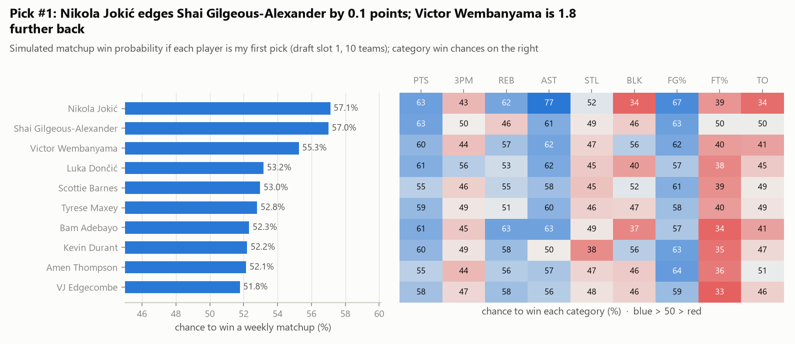

| Player | Pos | Value rank | Win % (matchup) | vs top-ranked (pts) |
|---|---|---|---|---|
| Nikola Jokić | C | 2 | 57.1 | +0.1 |
| Shai Gilgeous-Alexander | PG | 1 | 57.0 | +0.0 |
| Victor Wembanyama | PF/C | 3 | 55.3 | -1.8 |
| Luka Dončić | PG/SG/SF | 6 | 53.2 | -3.8 |
| Scottie Barnes | SG/SF | 5 | 53.0 | -4.0 |
| Tyrese Maxey | PG | 4 | 52.8 | -4.2 |
| Bam Adebayo | PF/C | 25 | 52.3 | -4.7 |
| Kevin Durant | SF/PF | 17 | 52.2 | -4.8 |
| Amen Thompson | SG/SF | 8 | 52.1 | -4.9 |
| VJ Edgecombe | PG/SG | 18 | 51.8 | -5.2 |

*Reading the heatmap* — each cell is the chance the resulting team wins that category in a typical week, after the rest of the draft plays out (so it reflects who the
engine expects to pick next, not just the player's own stats):

* **Nikola Jokić** — strongest: AST 77%, FG% 67%; weakest: BLK 34%, TO 34%
* **Shai Gilgeous-Alexander** — strongest: FG% 63%, PTS 63%; weakest: REB 46%, BLK 46%
* **Victor Wembanyama** — strongest: AST 62%, FG% 62%; weakest: FT% 40%, TO 41%

Because the engine sees every category's win chance, it also tells you what to pair with each player next.

### 9.4 Worked example: a whole mock draft from slot 5

Following the engine's recommendation at each of my 13 picks (against bots that draft by noisy value rank or ESPN ADP when available):

| round | pick # | engine picks | pos | win % after | best 'value rank' player left | engine vs that (pts) |
|---|---|---|---|---|---|---|
| 1 | 5 | Shai Gilgeous-Alexander | PG | 57.6 | Shai Gilgeous-Alexander | +0.0 |
| 2 | 16 | Tyrese Maxey | PG | 59.4 | Tyrese Maxey | +0.0 |
| 3 | 25 | Alperen Sengun | C | 62.4 | Anthony Edwards | +0.1 |
| 4 | 36 | Evan Mobley | C | 62.0 | Cade Cunningham | +0.5 |
| 5 | 45 | Naz Reid | PF/C | 63.2 | Cade Cunningham | +1.8 |
| 6 | 56 | Toumani Camara | SF/PF | 62.0 | Tyler Herro | +1.3 |
| 7 | 65 | Jaylen Brown | SG/SF | 62.6 | Tyler Herro | +0.6 |
| 8 | 76 | Brandon Miller | SF/PF | 61.8 | Brandon Miller | +0.0 |
| 9 | 85 | Paolo Banchero | SF/PF | 61.5 | Donte DiVincenzo | +1.6 |
| 10 | 96 | Pascal Siakam | SF/PF | 63.4 | Devin Vassell | +1.3 |
| 11 | 105 | Ausar Thompson | SG/SF | 64.8 | Brandon Ingram | +1.0 |
| 12 | 116 | Stephon Castle | PG | 65.4 | Keegan Murray | +1.3 |
| 13 | 125 | Keegan Murray | SF/PF | 66.4 | Keegan Murray | +0.0 |

The engine deviated from "take the best-value player left" at **9 of 13 picks**. In the rows where it did, the "engine vs that" column shows the simulated gain
in win probability from the deviation (positive by construction, since the engine takes the max over its candidates).

**Resulting roster** (3 centers, cap = 3):

| Player | Pos | MPG | GP% | PTS | 3PM | REB | AST | STL | BLK | TO |
|---|---|---|---|---|---|---|---|---|---|---|
| Shai Gilgeous-Alexander | PG | 33.9 | 79 | 31.4 | 1.8 | 4.7 | 6.9 | 1.6 | 0.8 | 2.6 |
| Tyrese Maxey | PG | 37.4 | 72 | 27.4 | 3.2 | 3.9 | 6.5 | 1.6 | 0.6 | 2.5 |
| Alperen Sengun | C | 33.3 | 80 | 20.8 | 0.6 | 9.5 | 6.0 | 1.2 | 0.9 | 3.0 |
| Evan Mobley | C | 31.6 | 74 | 18.3 | 1.0 | 9.2 | 3.6 | 0.8 | 1.6 | 2.0 |
| Jaylen Brown | SG/SF | 33.3 | 76 | 24.9 | 1.9 | 6.3 | 4.9 | 1.1 | 0.4 | 3.0 |
| Naz Reid | PF/C | 25.6 | 83 | 13.1 | 2.1 | 6.0 | 2.2 | 0.8 | 0.9 | 1.5 |
| Toumani Camara | SF/PF | 32.0 | 85 | 12.7 | 2.2 | 5.2 | 2.6 | 1.2 | 0.5 | 1.6 |
| Brandon Miller | SF/PF | 31.6 | 69 | 20.5 | 3.2 | 4.9 | 3.4 | 1.0 | 0.7 | 2.3 |
| Pascal Siakam | SF/PF | 31.6 | 74 | 20.5 | 1.5 | 6.5 | 3.7 | 0.9 | 0.4 | 2.0 |
| Ausar Thompson | SG/SF | 25.5 | 72 | 10.7 | 0.2 | 5.7 | 3.2 | 1.7 | 0.9 | 1.5 |
| Paolo Banchero | SF/PF | 34.7 | 71 | 24.0 | 1.5 | 8.0 | 5.3 | 0.8 | 0.6 | 3.1 |
| Keegan Murray | SF/PF | 31.8 | 66 | 13.7 | 1.9 | 5.7 | 1.7 | 0.9 | 0.9 | 1.0 |
| Stephon Castle | PG | 29.7 | 78 | 17.7 | 1.3 | 4.9 | 6.8 | 1.1 | 0.3 | 3.0 |

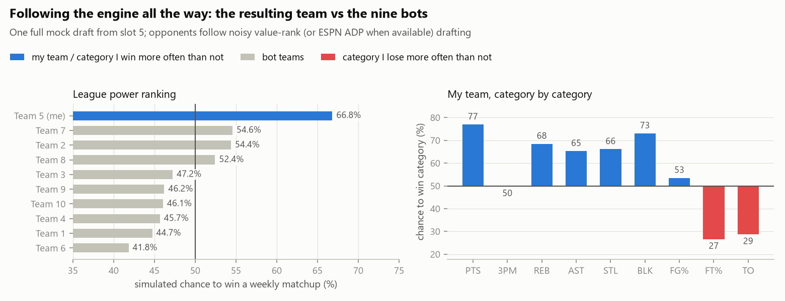

Simulated weekly-matchup win probability: **66.8%** following the engine vs **67.6%** taking the best-value player each time (same bots).
*Both numbers are measured against the engine's own simulated world, so only the gap is meaningful — section 10 tests whether the gap survives contact with real seasons.*

### 9.5 What a daily lineup looks like

The same roster in one simulated matchup (week 15, Feb 01 – Feb 07) — who fills which slot each day (BENCH = had a game but no open slot):

| day | PG | SG | G | SF | PF | F | C | UTIL | BENCH |
|---|---|---|---|---|---|---|---|---|---|
| Mon Feb 01 | Maxey | Brown |  |  |  |  | Mobley |  |  |
| Tue Feb 02 | Gilgeous-Alexander | Thompson |  | Camara | Banchero |  | Reid |  |  |
| Wed Feb 03 | Maxey | Brown |  | Thompson |  |  | Sengun | Mobley |  |
| Thu Feb 04 | Gilgeous-Alexander |  |  | Camara | Reid | Banchero | Mobley |  |  |
| Fri Feb 05 | Gilgeous-Alexander | Brown |  | Thompson | Reid |  | Sengun |  |  |
| Sat Feb 06 |  |  |  | Camara | Banchero |  | Mobley |  |  |
| Sun Feb 07 | Gilgeous-Alexander | Brown |  | Thompson |  |  | Sengun |  |  |

Notice days with several players listed under UTIL, and days where C or a flex slot sits empty because nobody eligible has a game: this is the effect a season-average
projection cannot see, and it is why the engine counts bench depth and positional spread.

## 10. Does it work? Historical validation on real seasons

The only honest test of a draft tool is: *would it have helped in a season it hasn't seen?* For each of the seasons below, we

1. rebuild everything as of that preseason — projections fitted on earlier seasons only, simulation library built from them and **that season's real schedule**;
2. run mock drafts (random draft slots, nine noisy bots) twice with identical bots: once taking the engine's recommendation at each pick, once simply taking the best-value player left
   (both respecting the 3-center cap);
3. score the two resulting rosters on what **really happened** that season: actual day-by-day box scores, same daily lineup / position-slot / matchup rules.

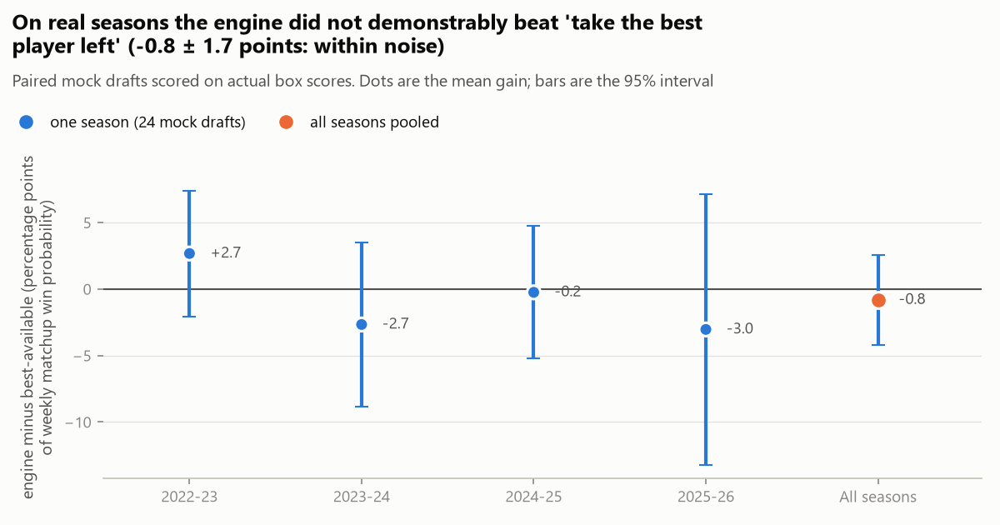

| season | mock drafts | engine win % | best-available win % | gain (pts) | ± SE | engine better in | model's own predicted gain (pts) |
|---|---|---|---|---|---|---|---|
| 2022 | 24 |  | 74.2 | +2.7 | 2.4 | 62% | +0.9 |
| 2023 | 24 |  | 68.8 | -2.7 | 3.1 | 38% | +1.9 |
| 2024 | 24 |  | 67.4 | -0.2 | 2.5 | 46% | +4.2 |
| 2025 | 24 |  | 67.3 | -3.0 | 5.2 | 38% | +7.2 |
| ALL | 96 | 68.6 | 69.5 | -0.8 | 1.7 | 46% | +3.5 |

**Result, plainly.** Averaged over 96 paired drafts the engine's team scored **-0.8 ± 1.7** percentage points of weekly matchup win probability relative to the
best-available team (ahead in 46% of drafts; better in 1 of 4 seasons). That is only 0.5 standard errors from zero, i.e. **within noise**: the evidence does not show the engine beating a good value ranking.
Over an 18-week regular season that is roughly -0.1 wins. 
**A cautious variant.** The model's own simulation expected a larger gain than reality delivered (+3.5 vs -0.8 points) — the classic sign of choosing the *argmax of noisy
near-ties*: among candidates whose simulated win probabilities differ by less than the estimate's noise, the "best" one is often just the luckiest estimate. So we also tested the engine in a mode where it overrides the
value ranking only when its pick is clearly better: among candidates within 1 point of the best simulated win probability it takes the highest-ranked by value (the 1-point margin was chosen from the noise level of the estimates, before looking at results).
Over the same 96 drafts that variant scored **+2.5 ± 1.3** points vs best-available (ahead in 53% of drafts).

**What to take from this.**
* **The projections and value board are doing nearly all the work.** Both strategies beat the nine noisy bots in about 70% of weekly matchups; a sound ranking is already a strong draft strategy.
* **The engine matches that ranking but is not shown to beat it.** Its real value is different: it *explains* each recommendation category by category, keeps track of positional slots and the center cap,
  and plans around what is likely to still be available — useful for judgment calls, not proven to add wins. When it and the value board disagree, treat it as roughly a coin flip and weigh your own category needs.
* **The model is over-optimistic about itself.** It predicted +3.5 points of gain and delivered -0.8. Throughout development, runs with different calendar, rookie and availability settings
  scored between roughly −1 and +5 points with standard errors of 1.5-1.7 — all consistent with a true effect near zero to small — so do not expect a reliably positive edge.
* Season-to-season results swing a lot (see the ± column) because injuries and breakouts decide drafts.
* **Absolute win percentages are inflated** because the bots draft with large random noise; real opponents are better. Only the *difference* between the strategies is informative.
* **Not covered by this test:** ESPN's real ADP and positional eligibility (the validation used our approximate eligibility for both strategies alike), human opponents' positional needs,
  in-season management (waivers, streaming, trades), and the IR slot.

## 11. Step by step: how everything fits together

| # | Step | Command | What it produces |
|---|---|---|---|
| 1 | Pull the data | `python scripts/ingest.py` | `data/processed/nba.db`: 11 seasons of box scores, ages, bios (incl. the rookie class) and the published 2026-27 schedule |
| 2 | ESPN positions + ADP | `python scripts/fetch_espn_positions.py` | `data/external/positions.csv` (needs a network that can reach ESPN) |
| 3 | Fit + backtest + project | `python scripts/build_projections.py` | `projections_2026.parquet/csv`, `backtest_summary.csv`, `backtest_oos.parquet`, `rookie_profiles.csv` |
| 4 | Calibrate + simulate | `python scripts/build_library.py` | `calibration.json`, `library_2026.npz` (the simulated weeks) |
| 5 | Draft | `streamlit run src/app/streamlit_app.py` | the live tool; state saved to SQLite after every pick |
| 6 | Validate (optional) | `python scripts/validate_draft.py` | `validation_results.csv` — section 10 |
| 7 | Rebuild this document | `python scripts/make_report.py` | this file and `REPORT.html` |

**On draft day:** create the league (10 teams, 13 rounds, your slot), record every pick as it happens — all teams, not just yours — flag anyone injured/out on the Player board, and
read the Recommendations tab on your turn ("Plan my next pick" looks ahead while others are on the clock). "Undo last pick" fixes data-entry mistakes.

**How each file maps to the story:**

| Module | Role |
|---|---|
| `src/data_ingestion/` | nba_api clients and SQLite loaders (idempotent) |
| `src/features/player_seasons.py` | the "ratio of totals" table and shrinkage definitions |
| `src/features/positions.py` | ESPN slot eligibility (ESPN file wins over the heuristic) |
| `src/models/projection.py` | Phase 1: baseline / Ridge / LightGBM, rolling backtest, rookie tiers |
| `src/simulation/calibration.py` | measures dispersion, correlation, absence structure, talent uncertainty from history |
| `src/simulation/copula.py` | Phase 2: schedule-aware, game-by-game Gaussian-copula simulator |
| `src/draft/state.py`, `store.py` | league settings, snake order, center cap, persistence |
| `src/draft/engine.py` | Phase 3: rollouts, daily-lineup scoring, recommendations |
| `src/app/streamlit_app.py` | the interface |

## 12. Limitations, assumptions, and open questions

**Modelling limits (stated, not hidden)**

* The daily lineup is a greedy fill in value order; a human optimises each day and can juggle slots, so true lineup efficiency is slightly higher than modelled.
* No in-season management: waivers, streaming, trades and the IR slot are not modelled — an injured draftee just misses games. Depth is therefore valued as bench coverage, not as waiver flexibility.
* Opponents are bots: they follow ADP/value rank plus noise, not positional need, team loyalty or auto-draft quirks. Absolute win percentages are relative to that bot model; compare candidates by *differences*.
* Teammates' game scripts and injuries are independent in the simulation; only the schedule is shared.
* "Out for the whole matchup" is drawn once per matchup period, so in the two-week periods (weeks 7 and 17) it overstates how often a player misses *both* weeks; week-long absences were measured on one-week windows.
* About 30 NBA Cup games are still TBD in the published schedule. They are ignored (week 7, Nov 30–Dec 13, uses only its published games, so it is the noisiest week); re-run `scripts/ingest.py` once
  the Cup bracket is set and they appear in the data automatically.
* Rookies are projected from draft-slot buckets, so two players taken in the same bucket (e.g. two top-5 picks) are identical in the model; a smoother curve was tested and was no more accurate.
  Supply rookie projections you trust via `data/external/projection_overrides.csv`.
* Not modelled (candidates if analysis shows they matter): contract-year effects, vacated usage after trades, coaching changes, injury types.

**Open questions for you**

1. **Draft rounds — 13 or 14?** The IR slot isn't drafted in the default; if your draft has 14 rounds, set roster size to 14 (the 14th pick is modelled as extra bench depth).
2. **Center cap definition.** Currently any **C-eligible** player (including PF/C types) counts toward the 3-center cap. Does ESPN count all of them, or only players slotted at C?
3. **ESPN eligibility.** The pipeline currently falls back to an approximation (from nba_api labels and assist/rebound rates). ESPN is blocked from the development machine, so please run
   `python scripts/fetch_espn_positions.py` once on your own network (or send me ESPN's eligibility list) — it also adds ADP, which makes the bots realistic.
4. **Playoffs.** If you tell me how many of the 10 teams make the playoffs I can add "chance to make the playoffs" (a season-level target) alongside weekly win probability; it would favour
   consistent teams over boom-bust ones slightly differently.
5. **Rookie projections.** If you have rookie numbers you trust (your own or ESPN's), send them or drop them in the overrides file — the top-5 picks are currently all treated alike.
6. **Draft mechanics.** Is there a pick timer / auto-draft for absent managers (affects how bots behave)? Any keepers or dropped-player rules before the season starts?

