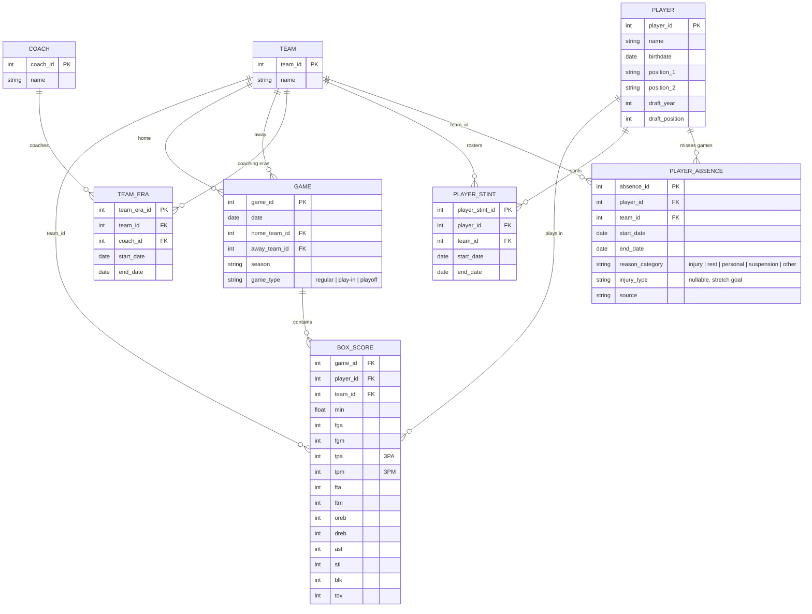

# Data Model

Core principle: separate **raw facts** (Game, Box Score — one row per game,
one row per player-game; source of truth, never edited after ingestion)
from **derived aggregates** (points, per-stint/era stats) which are always
computed from the raw facts, never stored independently. This is the same
fix that applies to `Points = 2*FGM + 3PM + FTM` (see the proposal review
doc) and to per-stint/era summary stats below — anything that's a formula
or an aggregate of other rows should be a view/query, not a column you
insert into directly, or the two can silently drift out of sync.

## Two different kinds of "stint" — keep them separate

- **`team_era`**: a team's coaching/roster context, bounded by coaching
  changes. Shared by every player on that roster during the window. Drives
  team-level context like pace — pace is a property of the coach and
  personnel currently in place, not a stable trait of the franchise, so
  don't trust a historical team average once the underlying roster/coach
  has changed.
- **`player_stint`**: one player's tenure with one team, bounded by trades.
  Drives which games represent a player's *current* situation (e.g., after
  a mid-season trade, only the post-trade stint's games are representative
  of their new role/usage).

Both tables hold only identity + date-range boundaries. All stats (pace,
PPG, OPPG, RPG, APG, etc.) are computed by joining back to `box_score`/
`game` filtered to that date range — never stored as columns on the
stint/era table itself.

## Schema



Notes on fields that deliberately do **not** appear:

- No `points` column on `box_score` — derive it: `2*fgm + tpm + ftm`.
  Same logic extends to FG% (`fgm/fga`) and FT% (`ftm/fta`) — always
  computed at query time from summed makes/attempts, never averaged from
  precomputed per-game percentages (see the proposal review doc's note on
  aggregating percentages correctly).
- No stat columns (pace/PPG/OPPG/RPG/APG) on `team_era` or `player_stint`
  — see views below.

## Example derived views

```sql
-- Player's stats for one stint (post-trade context, not season-blended)
CREATE VIEW player_stint_stats AS
SELECT
    ps.player_stint_id,
    AVG(2*bs.fgm + bs.tpm + bs.ftm) AS ppg,
    AVG(bs.oreb + bs.dreb) AS rpg,
    AVG(bs.ast) AS apg,
    SUM(bs.fgm) * 1.0 / NULLIF(SUM(bs.fga), 0) AS fg_pct,
    SUM(bs.ftm) * 1.0 / NULLIF(SUM(bs.fta), 0) AS ft_pct
FROM player_stint ps
JOIN box_score bs ON bs.player_id = ps.player_id AND bs.team_id = ps.team_id
JOIN game g ON g.game_id = bs.game_id
WHERE g.date BETWEEN ps.start_date AND ps.end_date
GROUP BY ps.player_stint_id;

-- Team's pace/scoring context for one coaching era
CREATE VIEW team_era_stats AS
SELECT
    te.team_era_id,
    COUNT(DISTINCT bs.game_id) AS games,
    AVG(2*bs.fgm + bs.tpm + bs.ftm) AS ppg_allowed_or_scored -- split by team vs opponent as needed
FROM team_era te
JOIN game g ON (g.home_team_id = te.team_id OR g.away_team_id = te.team_id)
JOIN box_score bs ON bs.game_id = g.game_id AND bs.team_id = te.team_id
WHERE g.date BETWEEN te.start_date AND te.end_date
GROUP BY te.team_era_id;
```

## How stint/era boundaries get populated

Not hand-entered — detected from the game log:

1. Sort each player's `box_score` rows by date.
2. Whenever `team_id` changes between consecutive rows for that player,
   close the current `player_stint` (set `end_date`) and open a new one.
3. Same pattern for `team_era`, keyed off coach-change events (requires a
   coach-by-team-by-date-range source — see the data acquisition notes;
   nba_api doesn't expose this cleanly, so this is one of the external
   pulls to line up alongside contract status and rookie comps).

## Injury / availability modeling

`GAME` minus `BOX_SCORE` tells you a player didn't play — it can't tell
you *why*, and that distinction matters: a healthy player resting on a
back-to-back by team policy is not the same signal as a recurring-injury
absence, even though both look identical as "no box score row." That's
what `PLAYER_ABSENCE` is for — a raw fact table (sourced externally, e.g.
Pro Sports Transactions; nba_api has no historical injury-report archive),
not something derived, since the reason can't be inferred from the box
score alone.

Scope this in levels rather than building the full version up front:

- **Baseline** (no new data needed): trailing games-played rate from
  `GAME`/`BOX_SCORE` alone, shrunk toward an age/role-bucket prior for
  low-sample players.
- **Better** (needs `PLAYER_ABSENCE`): same calculation, but with
  `reason_category = 'rest'` excluded from the "missed" count, so the
  rate reflects actual injury risk rather than team rest policy.
- **Stretch** (defer unless time allows): parse `injury_type` to model
  recurrence risk by injury category (ankle/hamstring issues recur far
  more than a one-off fracture) — real text-cleaning/categorization work,
  cut first if the investigation-phase cost/benefit doesn't justify it.

Expected games played should also condition on age and role/minutes, not
just a player's own trailing history — durability trends down with age
independent of specific injury history, and this is the same
age-as-a-feature reasoning already applied elsewhere in Phase 1.

## Known gaps / additional raw data needed

Not yet covered by this schema, in rough priority order:

- **Contract status** — needed to even run the contract-year significance
  test, let alone use it as a feature. External source (Spotrac/HoopsHype).
- **Coach-by-team-by-date-range data** — needed to populate `TEAM_ERA`
  boundaries; not available from nba_api.
- **Pre-NBA stats for rookies** (college/international per-40 rates) —
  only needed if going the comp-based rookie cold-start route rather than
  anchoring rookie projections to an existing external projection source.
- **Upcoming season's full schedule** — an operational timing issue, not
  a schema gap: `GAME` can hold future games with no `BOX_SCORE` rows yet,
  but the schedule itself isn't published until mid-to-late August.
- **Live injury-report feed for draft day** — distinct from historical
  injury modeling above; an operational need for Phase 3's live tool
  (don't recommend drafting someone currently out), not training data.
- **Validate box score completeness**: usage%/pace calculations depend on
  every player who took the floor having a row, including short garbage-
  time appearances. Spot-check that summed `MIN` per team per game equals
  240 (+ 5 per overtime period) before trusting derived team-level stats.


## Additions since the original design (implemented)

- `player` gained `rookie_year` (start year of first NBA season) and `last_year` (start year of the most
  recent season/roster) from nba_api `PlayerIndex`. Year convention everywhere: **start year** (2026 = the
  2026-27 season). `PlayerIndex` includes the incoming draft class before they have any box score, which is how
  rookies reach the draft pool. Position (`position_1/2`), `draft_year` and `draft_position` come from the same call.
- `player_season(player_id, season, age, team_id)` — age by season (`LeagueDashPlayerBioStats`). No bulk endpoint
  exposes birthdate, so `player.birthdate` stays NULL.
- `player_stint` is **rebuilt from scratch** (`load_to_db.rebuild_player_stints`) rather than appended to, which
  makes ingestion idempotent (this resolves the old "loaders are not idempotent" gap).
- Phase 3 state, all derived from an append-only pick log:
  - `league(name, n_teams, roster_size, active_slots, my_slot, season)`
  - `draft_pick(league_id, pick_no, team_slot, player_id)` — undo = delete the last row
  - `draft_exclusion(league_id, player_id)` — players the user flagged as injured/out

Not built (deliberately, see docs/methodology.md): coach/team-era data, historical injury reasons, contract status.
The `team_era`, `coach`, `player_absence` tables remain in the schema for later but nothing populates them, and
nothing downstream depends on them.
